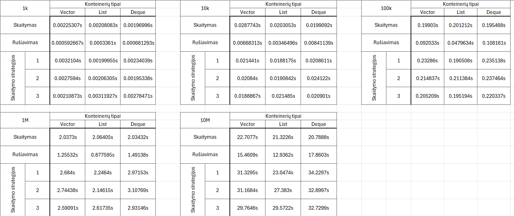
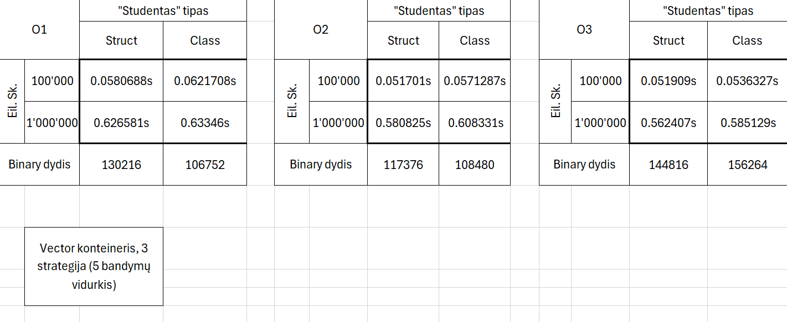

# VU_OP_2uzd-MS

## v.pradinė
### v.pradine.cpp
Studentų ir nd kiekis "hard-coded"\
Naudojami c masyvai\
Pasirenkama tarp 3 būdų įvesti duomenis:
- Įvesti duomenis ranka
- Generuoti pažymius
- Generuoti pažymius ir vardus

## v0.1
Studentų ir nd kiekis dinamiškas\
Masyvų duomenų spauzdinimas\
Pasirinkimas tarp vidurkio ir medianos skaičiavimo
### cmasyvas.cpp
Naudojami tik c masyvai
### vector.cpp
Naudojami <vector> objektai

## v0.2
Galimybė duomenis įvesti per failą\
Išspauzdinamų studnetų kiekio pasirinkimas\
Rikiavimas pagal skirtingus parametrus

## v0.3
Programa paskirstyta į kelis .cpp failus\
Sukurtas programą "apjungentis", struktūras apibrežentis header failas\
Naudojami try-catch blokai vartotojo įvesčiai (sukurta bendra funkcija tai įgyvendinti)

## v0.4
Duomenų (failų) generavimas\
Sugeneruotų studentų išvedimas į du skirtingus konteinerius (geri/blogi)\
Bendras programos veikimo laikas, kai generuojami 5 failai su nurodytasi dydžiais (15Nd): 118.9s (5 testų vidurkis)

## v1.0
trijų tipų konteineriai\
pritaikytos trys strategijos\
Atlikta spartumo diagnostika\
"..." Laiko tarpas didesnis negu 10min



Processor             Intel Core i7-11800H 2.30 GHz\
Installed RAM         16,0 GB (15,8 GB usable)\
System type	64-bit    Ubuntu 22.04.3 LTS on Windows 10 x86_64\
Storage               512GB SSD

Instrukcija kaip paleisti koda UNIX sistemoje:
1. Atidarę sistemos komandinę eilutę šiame aplanke įveskite `nano pazymiai.h`, modifikuokite failą taip, kad pirmos trys programos eilutės atrodytų kaip vienas iš pateiktų pavyzdžių:\
Vector versijai:
```
#ifndef Container
#define Container std::vector
#endif
```
List versijai:
```
#ifndef Container
#define Container std::list
#endif
```
Deque versijai:
```
#ifndef Container
#define Container std::deque
#endif
```
Uždarykite teksto retdaktorių su "Ctrl" ir "C" mygtukais vienu metu, išsaugokite failą (spauskite "Y" ir ENTER)\
2. Sistemos komandinėje eilutėje įrašykite `make`
3. Kad paleistumėte programą į komadinę eilutę įveskite: `./pazymiai` ir sekite instrukcijas programoje.

## v1.1
Vietoje struktūros naudojama klasė.\


norint sukompiliuoti paleidžiamus failus su skirtingoms optimizavimo vėliavoms:\
`make O1`, `make O2`, `make O3`

## v1.2
Implementuotos "rule of five" funkcijos\
Realizuotas kodas, kuris patikrina naujų operatorių, konstruktorių veikimą\
Įvestis:\
Duomenų įvestis rankiniu ir automatiniu būdu įvyksta, kai duomenų skaitymui yra naudojamas `istream` objektas, o tada žiūrima pagal vartotojo pasirinkta programos veikimą (globalų kintamąjį `inputOption`).\
Duomenų įvestis iš failo įvyksta, kai duomenų skaitymui naudojamas `istringstream` objektas.

Išvesties:\
Duomenų išvedimas per konsolę įvyksta, kai duomenų išvedimui yra naudojamas `ostream` objektas.
Duomenų išvedimas į failą įvyksta, kai duomenų išvedimui yra naudojamas `ofstream` objektas.

## v1.5
Sukurta abstrakti Zmogus klasė\
Perdaryti konstruktoriai\


## v2.0
Naudojamas Google test framework'as\
Parašyti porą "testinių" testų\


### instrukcija kaip paleisti programą UNIX(MacOS, Linux,...) sistemoje

1. Sistemos komandinėje eilutėje įrašykite `make`, ENTER
2. Kad paleistumėte programą, į komadinę eilutę įveskite: `./pazymiai` ir sekite instrukcijas programoje.
Kad paleistumėte programos testą, į komadinę eilutę įveskite: `./test_pazymiai`.
